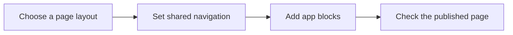

# DK1 Theme Shell

Build WordPress app pages with a shared sidebar, page header, and consistent controls.

DK1 Theme Shell is a block theme for developers building dashboards, internal tools, and app interfaces in WordPress. It brings the page layout and global styles together, so your app's blocks fit the interface around them.

## What you get

The theme provides the layout around your app. Your blocks and plugins provide its features and data.

- **Consistent styles:** colour, typography, and spacing presets align with the WordPress Design System (WPDS), helping core blocks and WPDS controls share the same visual language.
- **Shared navigation:** an editable sidebar template part carries workspace links, navigation sections, and profile controls across app pages.
- **Layouts for different content:** use the default app layout, a narrower Content page for documents, or Blank canvas for a page that supplies its own layout.
- **Mobile navigation:** styles support a sidebar drawer on small screens. With the sidebar block active, the theme adds Escape and tap-outside dismissal.
- **Account access:** signed-in users get a profile menu with sign-out access. The front-end WordPress toolbar is shown only to users with the `manage_options` capability, subject to their toolbar preference.
- **Optional assistant:** the app templates include an assistant area. With a compatible chat plugin, it starts closed and can be opened from an assistant control.

## How it fits your app



| Step | What you need | What the theme provides |
| --- | --- | --- |
| Choose a layout | A starting point for an app screen or document | App templates, Content page, and Blank canvas |
| Set navigation | The same routes across pages | A shared App sidebar template part |
| Add content | Controls that fit the surrounding page | WPDS-based presets and styles for the editor and front end |
| Check the result | A way to inspect longer pages and small screens | An App page, long pattern and responsive shell styles |

## Requirements

- **WordPress 7.1 or later**, as declared in the theme metadata, with the core `wp-theme` design-token stylesheet available.
- **PHP 7.4 or later**, as declared in the theme metadata.
- **WPDS Blocks** for the supplied `wpds/*` blocks, including the interactive sidebar. Sidebar collapse and resize behaviour come from the block plugin.
- **A compatible plugin registering `wpds-custom/ai-chat`** if you want the assistant. The theme doesn't include a chat service or model connection.

The block plugins aren't bundled. Saved markup alone doesn't provide their editing controls or interactive behaviour. Remove or replace unsupported blocks when adapting the templates to another setup.

## Install

1. Download `dk1-theme-shell-0.1.0.zip` from the [latest release](https://github.com/danielk-am/dk1-theme-shell/releases/latest).
2. In WordPress, open **Appearance → Themes → Add New → Upload Theme**.
3. Select the ZIP and install it.
4. Activate the block plugins needed by your pages.
5. Activate **DK1 Theme Shell** in WordPress.

The theme's CSS and JavaScript are ready to use. Installation doesn't require a build step.

## Create your first page

1. Create a page using the default page template.
2. Add your app's content blocks and publish the page.
3. Edit the **App sidebar** template part to replace the example navigation with your own destinations.
4. Open the published page and check its navigation at desktop and mobile widths.

The supplied sidebar includes example routes. It doesn't create the pages those links point to.

### Choose a different layout

| Layout | Use it for | Included structure |
| --- | --- | --- |
| Default page | Dashboards and app screens | Sidebar, page header, content, and assistant area |
| Content page | Help pages and longer documents | Site header, constrained content, and footer |
| Blank canvas | An interface that supplies its own layout | Page content with no surrounding header or sidebar |

The index, single-post, archive, search, and 404 templates also use the app layout.

### Check a longer screen

1. Create a test page using the default page template.
2. Insert the **App page, long** pattern.
3. Preview the page at desktop and mobile widths, then scroll through it.

Use this page to inspect navigation, content width, and scrolling with your installed block plugins. The **Token preview** pattern provides a separate sample of typography, controls, and surfaces.

## Customise

Edit shared template parts to change navigation and headers across pages. WordPress can store edited template parts in the database, where they take precedence over the files in this theme.

Use a child theme for changes you want to keep separate from theme updates. The presets in [theme.json](theme.json) include colour, spacing, and font settings, with separate `body`, `heading`, and `mono` font families.

The translation text domain is `dk1-theme-shell`. Existing pattern names keep the `wpds-canvas` prefix so saved pattern references continue to work.

## Development

| File | Purpose |
| --- | --- |
| [theme.json](theme.json) | Global presets, element styles, and template definitions |
| [functions.php](functions.php) | Stylesheet loading, account menu, and assistant integration |
| [templates/](templates/) and [parts/](parts/) | Page layouts and shared template parts |
| [patterns/](patterns/) | Reusable sidebar sections and sample pages |
| [assets/css/](assets/css/) | Canvas, header, sidebar, and assistant styles |
| [assets/js/app-shell.js](assets/js/app-shell.js) | Drawer dismissal, profile menu, and assistant controls |
| [tools/token-map.json](tools/token-map.json) | Preset-to-token mappings used by the drift check |

The theme loads WordPress's registered `wp-theme` stylesheet on the front end. Preset values stay as literals in `theme.json` so editor controls can display them. The token check detects differences between those values and the installed token definitions.

Run from the theme directory with Node.js available:

```bash
npm run check
```

The check expects the theme inside a WordPress installation. For a standalone checkout, provide the token file explicitly:

```bash
node tools/check-tokens.mjs --tokens=/path/to/design-tokens.css
```

Additional token files can be supplied with another `--tokens=` argument. When installed beside the theme, the checker also looks for the WPDS plugin's token file at `plugins/dk1-blocks-wordpress-ui/assets/design-tokens.css`.

The check covers token mappings and references. Browser checks are still needed for layout, keyboard navigation, and plugin interactions.

## Contributing

Keep changes focused and describe the affected page or control in the pull request. For style changes, run the token check and inspect both the editor and the published page. Include the WordPress and plugin versions used, plus any checks you couldn't run.

## Credits and licence

Maintained by Daniel Kam, with assistance from ChatGPT.

Version 0.1.0. Updated September 20, 2026.

Licensed under GPL-2.0-or-later, as declared in [style.css](style.css).
